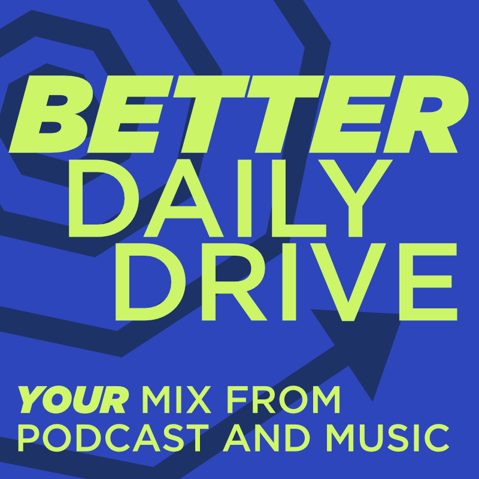
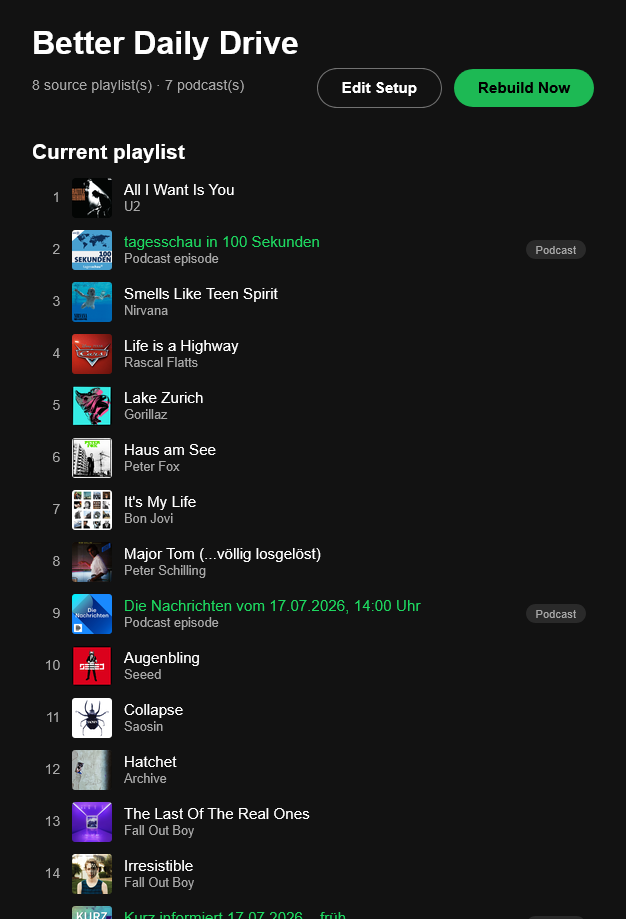
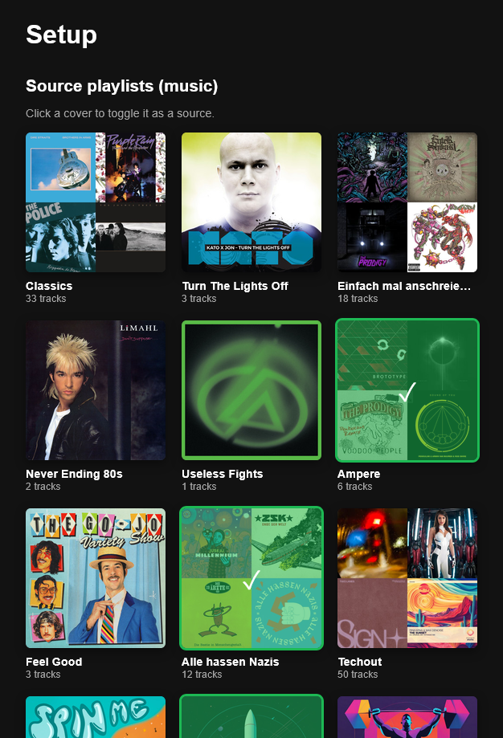
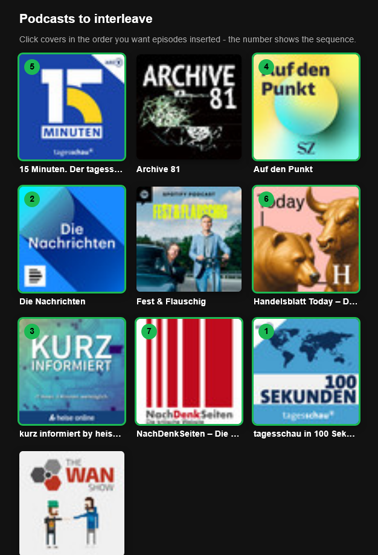

## Better Daily Drive

Spotifys Daily Drive is a nice but flawed feature. 
Its not customizable what Podcast should be used and the Track Selection is not varied enough and way to fixed to your most played songs.
Using just your most played and liked songs created a loop when you listen to Daily Drive every day, your most listened songs gets more listens which makes them more likely to be placed into the Daily Drive making it impossible to get a true random selection of you music.

This small CLI fixes this with a custom way to create you own Daily Drive. 
This script could be run via a cron job for example with regular update intervals picking the newest version of a podcast.

#### Also if youre in a market where Daily Drive doesnt exist, e.g. Colombia this is the perfect solution to now kinda have it.

## Usage

Console mode (original interactive/cron flow):

```
dotnet run --project BetterDailyDrive
```

Web UI mode — does the same setup (Client ID entry, Spotify login, source playlist/podcast selection) and triggering through a local browser page instead of console prompts:

```
dotnet run --project BetterDailyDrive -- --ui
```

Then open http://localhost:5080 in your browser. Both modes share the same saved `spotify_auth_data.json` / `playlist_config.json`, so you can set up in one and trigger from the other. Stop the web UI with Ctrl+C in its terminal.

The web UI also has a **Settings** screen for automatic rebuilds - add times of day (24h, server's local time zone) and it rebuilds the playlist on its own at each one, with no cron job needed, as long as the process keeps running. This only applies to `--ui` mode; the console flow doesn't have a built-in scheduler and is meant to be driven by an external cron job instead (see below).

### Screenshots

Dashboard - current playlist, config summary, and the rebuild trigger:



Setup - pick source playlists by clicking their cover art:



Setup - pick podcasts and their interleave order, shown as numbered badges:



## Building

**Just to check it compiles / run it locally:**

```
dotnet build BetterDailyDrive
```

This requires the .NET 10 SDK on the machine you're building on, and the .NET 10 ASP.NET Core Runtime on whatever machine actually runs it (the `--ui` mode needs it).

**For deployment (e.g. to a cron server), publish a self-contained single-file binary instead** - it bundles the whole .NET runtime into one file, so the target machine needs nothing installed at all:

```
dotnet publish BetterDailyDrive -c Release -r <RID> --self-contained true -p:PublishSingleFile=true -p:IncludeNativeLibrariesForSelfExtract=true -o ./publish
```

Pick `<RID>` for your target:

| Target | RID |
|---|---|
| Linux x64 (typical server) | `linux-x64` |
| Linux ARM64 (e.g. Raspberry Pi, Graviton) | `linux-arm64` |
| Linux, musl-based (e.g. Alpine) | `linux-musl-x64` |
| Windows x64 | `win-x64` |

The `./publish` folder then contains just one binary (`BetterDailyDrive` on Linux, `BetterDailyDrive.exe` on Windows, ~100+ MB since the runtime is bundled in) plus an optional `.pdb` (debug symbols only, safe to leave behind). Copy that one file to the target machine, `chmod +x` it on Linux, and run it directly - no `dotnet` command needed there:

```
./BetterDailyDrive          # or BetterDailyDrive.exe on Windows
./BetterDailyDrive --ui
```

**Headless Linux server caveat**: the first interactive login opens a browser via `xdg-open`, which needs a graphical session and will fail on a bare server. Either do the first login on a machine with a browser and copy over the resulting `spotify_auth_data.json`/`playlist_config.json` (plain JSON, no OS-specific paths, safe to move), or run `--ui` on the server and SSH-tunnel port 5080 to your own machine to reach the login button from there.

## Running on a schedule

**Web UI mode**: use the Settings screen (see Usage above) - add times of day there and it rebuilds itself automatically, no cron needed. It only checks while the process is actually running, so pair it with `restart: unless-stopped` (Docker) or a process manager/systemd unit if you want it to survive reboots.

**Console mode**: use an external cron job. Example crontab entry to rebuild the playlist four times a day (7am, noon, 4pm, 7pm):

```cron
0 7,12,16,19 * * * cd /opt/betterdailydrive && ./BetterDailyDrive-linux-x64 >> run.log 2>&1
```

A few things that matter for this to actually work:

- **`cd` into the app's directory first** - `spotify_auth_data.json` and `playlist_config.json` are read/written relative to the current working directory, and cron runs with a minimal environment (no assumed working directory).
- **Do the very first run manually, interactively**, before adding the cron job - it needs to prompt for your Client ID and walk through Spotify login/setup once. Cron can't do that (no terminal, no browser); the app detects this and fails with a clear message instead of hanging, but it still needs that one manual run to create the auth/config files cron will reuse afterward.
- **`>> run.log 2>&1`** captures output somewhere, since cron normally discards it (or mails it, which is easy to miss). Worth checking that log occasionally, especially since the refresh token eventually expires (~6 months) and needs that manual re-login step again.
- Swap `BetterDailyDrive-linux-x64` for whichever binary you actually deployed (e.g. the ARM64 one on a Raspberry Pi), and `chmod +x` it first if you haven't already.

## Running with Docker

`docker-compose.yml` at the repo root pulls a pre-built image from GitHub Container Registry - no local build, no source checkout, no .NET SDK needed. It always launches in `--ui` mode, since that's the only mode that makes sense with no interactive terminal attached.

```bash
docker compose up -d
```

This starts the container, publishes port 5080, and mounts `./data` (next to the compose file) into the container as `/data` - that's where `spotify_auth_data.json`/`playlist_config.json` live, so your setup and login survive container restarts/updates. Open `http://<host>:5080` (reachable from other devices on the same network too) and use the Settings screen for scheduled rebuilds (see above) instead of cron - a container doesn't have cron running inside it.

**Login requires one required config step, not just the usual headless-container caveat.** Two separate things are true here:

1. The container has no browser, so clicking "Login with Spotify" can't automatically open one - same as any other headless environment. Watch the container logs (`docker compose logs -f`) right after clicking Login; the authorization URL is always printed there even when auto-opening a browser fails, so you can copy-paste it into a browser on any device.
2. **More importantly**: after you approve the login in that browser, Spotify redirects it to a fixed callback URL to finish the flow. By default that URL is `http://127.0.0.1:58739/callback`, which only resolves correctly when the browser doing the login is on the *exact same machine* as the container - never true when running this in Docker on a NAS/server, since you're completing login from your own laptop/phone. Without fixing this, the login will look like it's hanging or silently failing at the final step even after you approve it in Spotify.

   Fix it by setting `CALLBACK_HOST` (already in `docker-compose.yml`, defaulted to a placeholder) to whatever IP/hostname your browser can actually reach this machine at - typically the host's LAN IP - **and** adding `http://<that same value>:58739/callback` as a Redirect URI in your app's settings at the [Spotify Developer Dashboard](https://developer.spotify.com/dashboard) (Spotify rejects anything not on that exact allow-list). `docker-compose.yml` also publishes port 58739 for this reason - that's the callback port, separate from the dashboard's port 5080.

If you'd rather sidestep all of this: do the first login somewhere with a real browser and no networking complications (your own machine, console mode or `--ui` locally with the default `127.0.0.1`), then copy the resulting `spotify_auth_data.json`/`playlist_config.json` into the container's `./data` folder before starting it.

### How the image gets built

`.github/workflows/docker-publish.yml` builds `Dockerfile` (which fetches the matching self-contained binary from whichever release the workflow is building for, rather than compiling from source) and pushes it to `ghcr.io/enslaved2die/betterdailydrive` whenever a release is published, tagged both `:latest` and with that release's own tag. `docker-compose.yml` just pulls `:latest`; pin a specific tag there instead if you'd rather control upgrades deliberately - either way it only updates on `docker compose pull` (or `up -d --pull always`), not automatically on container restart.

**One-time setup after adding this workflow**: it needs to actually run once (either publish a new release, or trigger it manually via the Actions tab → "Publish Docker image" → "Run workflow") before the image exists at all. The first time it pushes, the resulting GHCR package is likely **private by default** - go to the package's settings on GitHub and set visibility to Public, or `docker compose pull` will fail with a permission error on any machine that isn't authenticated to GHCR.

I don't have Docker available to test any of this myself - worth verifying the workflow run succeeds and the image pulls cleanly before relying on it.
