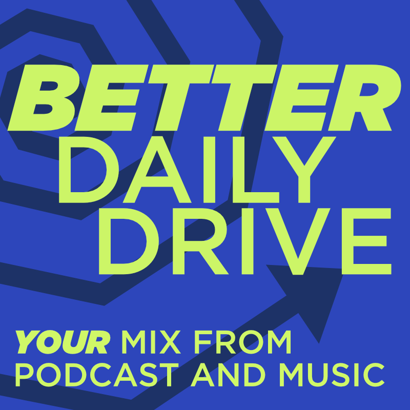

## Better Daily Drive

Spotifys Daily Drive is a nice but flawed feature. 
Its not customizable what Podcast should be used and the Track Selection is not varied enough and way to fixed to your most played songs.
Using just your most played and liked songs created a loop when you listen to Daily Drive every day, your most listened songs gets more listens which makes them more likely to be placed into the Daily Drive making it impossible to get a true random selection of you music.

This small CLI fixes this with a custom way to create you own Daily Drive. 
This script could be run via a cron job for example with regular update intervals picking the newest version of a podcast.

#### Also if youre in a market where Daily Drive doesnt exist, e.g. Colombia this is the perfect solution to now kinda have it.
